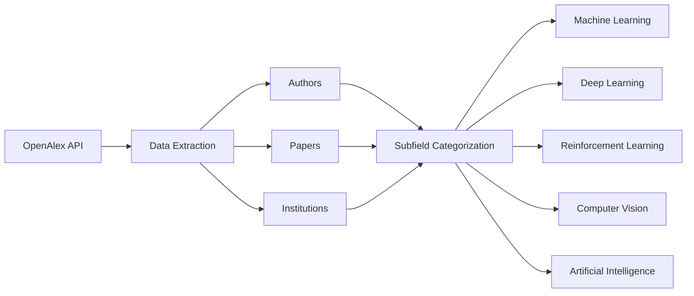
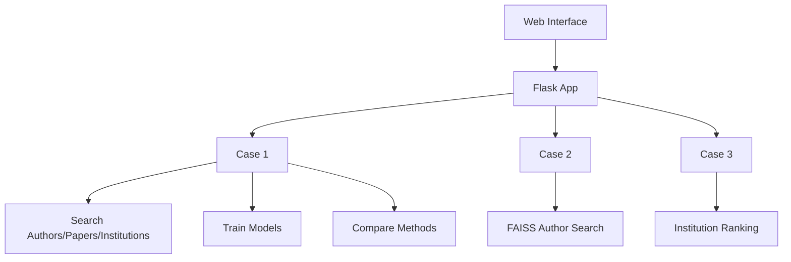

# Who has been doing AI? DEMO Engine

This repository contains the final BSc AI project at VU Amsterdam, authored by **Melnic Mihaita-Nicusor**, under the supervision of **Filip Ilievski**.

---

## About the Data

The data has been extracted from the **OpenAlex API**, and categorized into **Authors**, **Papers**, and **Institutions**.

Each of them includes 4 subfields of AI:
- Machine Learning
- Deep Learning
- Reinforcement Learning
- Computer Vision

For each subfield, 10,000 data entries were retrieved via:
- Concept-based search
- Title & abstract keyword filtering
- Filtering by primary field (AI or subfields)

---

## About the Code

The code is split into **two parts**:
1. **Data Extraction and Preprocessing Pipeline**

2. **Interactive Demo Engine Pipeline**

The demo is built in **Python** with a frontend in index.html using embedded JavaScript for interaction.

---

## Demo Engine Architecture

The engine supports **3 main use-cases**:

### Case 1: Search + Metadata Comparison
- **Step 1**: Search Authors / Papers / Institutions
- **Step 2**: Compare metadata with a given topic using:
  - **DPR** (facebook-dpr-question_encoder-single-nq-base, facebook-dpr-ctx_encoder-single-nq-base, MiniLM)
  - **TF-IDF** (max_features=500, ngram_range=(1,2), sublinear_tf=True)
  - **LSA** (TruncatedSVD)
  - Cosine similarity for all comparisons
- Returns top results ordered by similarity score

### Case 2: Author-Topic Alignment
- Uses **FAISS** indexing and the full authors dataset
- Maps user topic to concept space
- Searches authors across concepts using similarity
- Returns top 5 author profiles with matching metadata

### Case 3: Institution Ranking
- Uses trained models from Case 1
- Scores institutions by topic relevance (via paper similarity)
- Aggregates over time & geography
- Returns top 10 contributing institutions (modifiable query)

---

## Author & Supervisor

- **Author**: Melnic Mihaita-Nicusor  
- **Supervisor**: Filip Ilievski  
- **University**: Vrije Universiteit Amsterdam  
- **Program**: BSc Artificial Intelligence (3rd Year Final Project)

--- 
