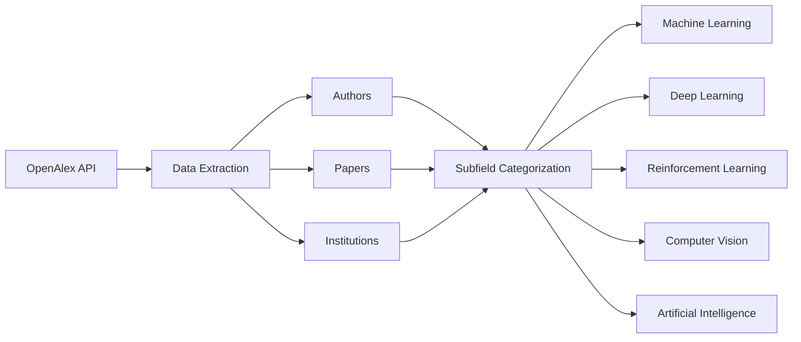

# Who has been doing AI? DEMO Engine

This repository contains the final BSc AI project at VU Amsterdam, authored by **Melnic Mihaita-Nicusor**, under the supervision of **Filip Ilievski**.

---

## About the Data

The data has been extracted from the **OpenAlex API**, and categorized into **Authors**, **Papers**, and **Institutions**.

Each of them includes 4 subfields of AI:
- Machine Learning
- Deep Learning
- Reinforcement Learning
- Computer Vision
---

**Data Extraction and Preprocessing Pipeline**

---

## Code Structure and Experimentdal Designs
The `searching_codes/` directory contains the Python scripts and data files used for data collection, processing, and analysis, aligning with the methodology outlined in the thesis, particularly in Section 3: Methodology.

`searching_codes/institutions_by_domain/`
These JSON files contain processed data related to institutions, and helps on the application of the institutional ranking formula mentioned in the thesis. This data is used to identify and rank influential institutions within each AI domain.

`searching_codes/papers_by_concept/`
Similar to `institutions_by_domain/`, these JSON files store processed data related to academic papers, categorized by AI concept. This data is crucial for tracking topic development and identifying key papers within each subfield, as detailed in the thesis for institutions.

`searching_codes/top_authors_concept/`
This subdirectory holds JSON files (`top_ai_authors_with_papers.json`, `top_cv_authors.json`, etc.) that contain information about the most influential authors in each AI subfield. These files are the result of applying the author ranking methodologies, as detailed in the thesis for author profiling.

`file.py` and `index.html` the recommendation framework. `index.html` is the front-end interface, and `file.py` serves as a backend script to handle user queries and interact with the processed data and retrieval models. This aligns with the thesis's purpose to provide a "scalable and user-friendly tool that can support students and early-career researchers" and a "connected interface" for literature search and recommendations.

The provided code structure directly showcase how to arrive to the experimental design and methodologies detailed in the thesis. The data files (`all_data/`, `institutions_by_domain/`, `papers_by_concept/`, `top_authors_concept/`) represent the output of the data collection and processing phases, the Python code implement the core analytical and retrieval mechanisms. The `index.html` display the implementation of the user-friendly interface, bringing the theoretical framework into a practical application. This organization ensures that the code base is a direct, verifiable implementation of the research presented in the thesis. 

---

## Author & Supervisor

- **Author**: Melnic Mihaita-Nicusor  
- **Supervisor**: Dr. Filip Ilievski  
- **University**: Vrije Universiteit Amsterdam  
- **Program**: BSc Artificial Intelligence (3rd Year Final Project)

--- 
